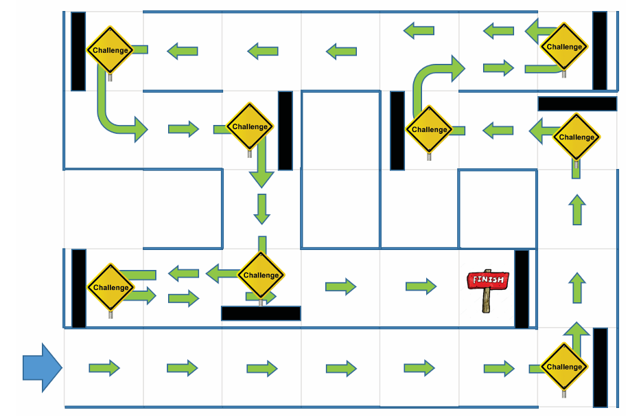

# The A-maze-ing-Race Project

The goal of the project is to design and program a mBot capable of navigating through a maze in the shortest time possible while completing various waypoint challenges. These challenges involve detecting coloured waypoints and executing the correct turning maneuvers based on the decoded colour signals. 

## Project Highlights
The robot integrates multiple sensors, including an ultrasonic sensor, an infrared (IR) sensor, a line sensor, and a colour-sensing module. This enables the bot to detect maze walls, align itself, and interpret colour-based commands to perform accurate turns. 

## Overview of mBot

| Front View | Back View |
|------------|-----------|
|  |  |

| Left View | Right View |
|-----------|------------|
|  |  |

## Maze Layout
The mBot must be able to navigate through the maze without hitting the maze walls, and this can be done using
the ultrasonic and infrared sensors.

***Sample Maze Layout***

While navigating the maze, the mBot's line sensor would look for a black line. Once detected, it would stop and perform the corresponding manoeuvre based on the table shown below.  

Once it detects a white coloured paper, it marks the end of the maze.

  
***Manoeuvres based on coloured paper***

## How to Use
Copy the full arduino code from [here](https://github.com/gavinlimsh/CG1111A-A-maze-ing-Race/blob/main/final.ino). 
Edit the hardware ports based on your connections. 

<table>
  <tr>
    <th colspan="2">Sensor Connections</th>
    <th colspan="2">Motor Connections</th>
  </tr>
  <tr>
    <th>Sensor</th>
    <th>Port</th>
    <th>Side</th>
    <th>Port</th>
  </tr>
  <tr>
    <td>Ultrasonic Sensor</td>
    <td>2</td>
    <td>Left</td>
    <td>M1</td>
  </tr>
  <tr>
    <td>Line Follower</td>
    <td>3</td>
    <td>Right</td>
    <td>M2</td>
  </tr>
</table>

<i><b>This table shows our current mBot sensor and motor connections</b></i>

## Implementation
Our final group report containing more detailed explanations of the hardware design and software algorithms can be found [here](https://github.com/gavinlimsh/CG1111A-A-maze-ing-Race/blob/main/Report.pdf).

## Contributors
| Name | Github Link |
|-----------|------------|
| Pei Ling | [Github](https://github.com/) |
| Gavin | [Github](https://github.com/gavinlimsh) |
| Lim Sin | [Github](https://github.com/wunicorn21) |
| Wei Xiong | [Github](https://github.com/) |
